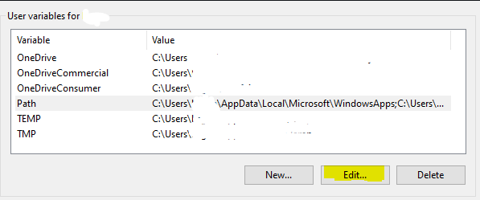

# What is Terraform? What is it used for?
Terraform is an open-source Infrastructure as Code (IaC) tool created by HashiCorp. It allows you to define, provision, and manage infrastructure across multiple cloud providers using a declarative configuration language called HashiCorp Configuration Language (HCL).

- Define infrastructure in code (version-controlled and reusable).
- Deploy, change, and manage infrastructure safely and efficiently.
- Automate complex setups and orchestration of infrastructure resources.

## Why use Terraform? The benefits?
- **Multi-cloud support**: Manage infrastructure across different cloud providers.
- **Declarative syntax**: Define the desired infrastructure state, and Terraform handles the rest.
- **Version control**: Treat infrastructure as code, allowing for tracking and reusability.
- **Orchestration**: Automates resource dependency management and deployment order.
- **Collaboration**: Provides tools for team workflows (remote state, workspaces).
- **Idempotency**: Ensures consistent infrastructure through repeatable operations.

## Alternatives to Terraform
- **AWS CloudFormation**: AWS-native IaC tool.
- **Pulumi**: Allows infrastructure configuration in programming languages (Python, TypeScript).
- **Ansible, Chef, Puppet**: Configuration management with some provisioning capabilities.

## Who is using Terraform in the industry?
Terraform is widely adopted by various companies across industries for managing cloud infrastructure:

- AWS, Azure, and Google Cloud partners.
- Financial institutions.
- Technology companies like GitHub, Slack, and Netflix.
- Consulting firms use it for client cloud automation.

## In IaC, what is orchestration? How does Terraform act as "orchestrator"?
It refers to the automation of complex operations involving multiple services working together. It involves coordinating the deployment, scaling, configuration and management of multiple resources and services.

## Best practice supplying AWS credentials to Terraform
- Use environment variables, shared credentials files, or IAM roles.
- Avoid hardcoding credentials in Terraform files or scripts.

## If Terraform needs AWS access, there are different options on supplying the AWS credentials to Terraform. What is order in which Terraform looks up AWS credentials (which ways take precedence/priority)?
1. **Environment variables**: AWS_ACCESS_KEY_ID, AWS_SECRET_ACCESS_KEY
2. **Shared credentials file**: ~/.aws/credentials
3. **AWS config file**: ~/.aws/config
4. IAM role attached to an EC2 instance

## What is best practice to supply AWS credentials? Include: How should AWS credentials never be passed to Terraform?
- Use environment variables or the AWS credentials file for local development.
- For cloud environments, prefer IAM roles to avoid managing static credentials.
- Never hardcode AWS credentials in Terraform files or commit them to version control.

## Why use Terraform for different environments (e.g. production, testing, etc)
- Ensure consistent infrastructure across environments.
- Use workspaces and modules to isolate and manage multiple environments easily.
- Allows testing in non-production environments before deploying changes to production.

## How to install Terraform
1. Navigate to the website.
2. Download the version you need. In our case, it's Windows 386.
3. Unzip the file and move it to your (C:) drive. 

4. Search for **edit the system environment variables** in your Windows search bar. Select it.

5. Once the window pops up, click **environment variables**. 

6. Select your **Path** variable and click **edit**.

7. Select **New** and paste in the path file for the **Terraform folder**. And done!

## How to put your access keys onto your system. 

1. Repeat steps 1 - 5. 
2. Instead of editing **user variables**, we will add to the **system variables**.

3. Name and add your ID and key! I won't be showing you this bit. It's a secret.