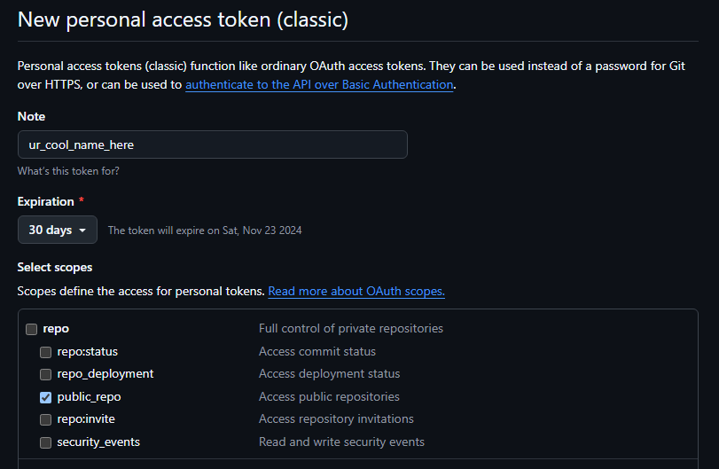

- [What is Terraform? What is it used for?](#what-is-terraform-what-is-it-used-for)
  - [Why use Terraform? The benefits?](#why-use-terraform-the-benefits)
  - [Alternatives to Terraform](#alternatives-to-terraform)
  - [Who is using Terraform in the industry?](#who-is-using-terraform-in-the-industry)
  - [In IaC, what is orchestration? How does Terraform act as "orchestrator"?](#in-iac-what-is-orchestration-how-does-terraform-act-as-orchestrator)
  - [Best practice supplying AWS credentials to Terraform](#best-practice-supplying-aws-credentials-to-terraform)
  - [If Terraform needs AWS access, there are different options on supplying the AWS credentials to Terraform. What is order in which Terraform looks up AWS credentials (which ways take precedence/priority)?](#if-terraform-needs-aws-access-there-are-different-options-on-supplying-the-aws-credentials-to-terraform-what-is-order-in-which-terraform-looks-up-aws-credentials-which-ways-take-precedencepriority)
  - [What is best practice to supply AWS credentials? Include: How should AWS credentials never be passed to Terraform?](#what-is-best-practice-to-supply-aws-credentials-include-how-should-aws-credentials-never-be-passed-to-terraform)
  - [Why use Terraform for different environments (e.g. production, testing, etc)](#why-use-terraform-for-different-environments-eg-production-testing-etc)
- [How to install Terraform](#how-to-install-terraform)
  - [How to put your access keys onto your system.](#how-to-put-your-access-keys-onto-your-system)
- [Terraform Diagram](#terraform-diagram)
  - [Local Machine (Installed Terraform)](#local-machine-installed-terraform)
  - [Storing in a Module](#storing-in-a-module)
  - [Run Commands](#run-commands)
  - [Terraform Formatting (`terraform fmt`)](#terraform-formatting-terraform-fmt)
  - [Usual Workflow](#usual-workflow)
  - [Cloud Providers](#cloud-providers)
  - [Providing Credentials](#providing-credentials)
    - [In summary:](#in-summary)
- [How to set up an EC2 instance with terraform](#how-to-set-up-an-ec2-instance-with-terraform)
- [Adding Variables in Terraform](#adding-variables-in-terraform)
- [How to create a GitHub repo using Terraform](#how-to-create-a-github-repo-using-terraform)


# What is Terraform? What is it used for?
Terraform is an open-source Infrastructure as Code (IaC) tool created by HashiCorp. It allows you to define, provision, and manage infrastructure across multiple cloud providers using a declarative configuration language called HashiCorp Configuration Language (HCL).

- Define infrastructure in code (version-controlled and reusable).
- Deploy, change, and manage infrastructure safely and efficiently.
- Automate complex setups and orchestration of infrastructure resources.

## Why use Terraform? The benefits?
- **Multi-cloud support**: Manage infrastructure across different cloud providers.
- **Declarative syntax**: Define the desired infrastructure state, and Terraform handles the rest.
- **Version control**: Treat infrastructure as code, allowing for tracking and reusability.
- **Orchestration**: Automates resource dependency management and deployment order.
- **Collaboration**: Provides tools for team workflows (remote state, workspaces).

## Alternatives to Terraform
- **AWS CloudFormation**: AWS-native IaC tool.
- **Pulumi**: Allows infrastructure configuration in programming languages (Python, TypeScript).
- **Ansible, Chef, Puppet**: Configuration management with some provisioning capabilities.

## Who is using Terraform in the industry?
Terraform is widely adopted by various companies across industries for managing cloud infrastructure:

- AWS, Azure, and Google Cloud partners.
- Financial institutions.
- Technology companies like GitHub, Slack, and Netflix.
- Consulting firms use it for client cloud automation.

## In IaC, what is orchestration? How does Terraform act as "orchestrator"?
It refers to the automation of complex operations involving multiple services working together. It involves coordinating the deployment, scaling, configuration and management of multiple resources and services.

## Best practice supplying AWS credentials to Terraform
- Use environment variables, shared credentials files, or IAM roles.
- Avoid hardcoding credentials in Terraform files or scripts.

## If Terraform needs AWS access, there are different options on supplying the AWS credentials to Terraform. What is order in which Terraform looks up AWS credentials (which ways take precedence/priority)?
1. **Environment variables**: AWS_ACCESS_KEY_ID, AWS_SECRET_ACCESS_KEY
2. **Shared credentials file**: ~/.aws/credentials
3. **AWS config file**: ~/.aws/config
4. IAM role attached to an EC2 instance

## What is best practice to supply AWS credentials? Include: How should AWS credentials never be passed to Terraform?
- Use environment variables or the AWS credentials file for local development.
- For cloud environments, prefer IAM roles to avoid managing static credentials.
- Never hardcode AWS credentials in Terraform files or commit them to version control.

## Why use Terraform for different environments (e.g. production, testing, etc)
- Ensure consistent infrastructure across environments.
- Use workspaces and modules to isolate and manage multiple environments easily.
- Allows testing in non-production environments before deploying changes to production.

# How to install Terraform
1. Navigate to the website.
2. Download the version you need. In our case, it's Windows 386.
3. Unzip the file and move it to a location of your choosing. 

4. Search for **edit the system environment variables** in your Windows search bar. Select it.


5. Once the window pops up, click **environment variables**. 


6. Select your **Path** variable and click **edit**.


7. Select **New** and paste in the path file for the **Terraform folder**. And done!


## How to put your access keys onto your system. 

1. Repeat steps 1 - 5. 
2. Instead of editing **user variables**, we will add to the **system variables**.


3. Name and add your ID and key! I won't be showing you this bit. It's a secret.

# Terraform Diagram 

## Local Machine (Installed Terraform)
You run Terraform from your local machine, where Terraform is installed.

## Storing in a Module
All the Terraform code (written in `.tf` files) is organized in a module (usually a folder).
The primary file is `main.tf`, where the infrastructure configuration is defined.

## Run Commands
The core Terraform workflow consists of running the following commands:
- `terraform init`: Initializes the working directory with necessary plugins.
- `terraform plan`: Previews the changes that Terraform will make to your infrastructure.
- `terraform apply`: Applies the changes to provision the infrastructure.
- `terraform destroy`: Destroys the created infrastructure (this is destructive and should be used carefully).

## Terraform Formatting (`terraform fmt`)
`terraform fmt`: A command used to automatically format and fix indentations in Terraform files, ensuring code consistency and readability.

## Usual Workflow
The usual workflow is to:
1. Write your configuration (in `main.tf` or other `.tf files`).
2. Initialize Terraform (`terraform init`).
3. Preview the changes (`terraform plan`).
4. Apply the changes (`terraform apply`).
- Optionally, destroy the infrastructure if needed (`terraform destroy`).

## Cloud Providers
After defining your infrastructure, Terraform can be used to provision resources on different cloud platforms, such as:
**AWS** (Amazon Web Services)
**GCP** (Google Cloud Platform)
**Azure** (Microsoft Azure)

## Providing Credentials
To interact with cloud providers (like AWS, GCP, or Azure), you need to provide credentials. These credentials allow Terraform to authenticate and provision resources on the cloud platforms.

### In summary:
- You write Terraform code in a module.
- Run the commands `init`, `plan`, `apply`, and `destroy` to manage infrastructure.
- Format the code with `terraform fmt`.
- Provide cloud credentials to authenticate Terraform with AWS, GCP, or Azure.

# How to set up an EC2 instance with terraform 
1. Create environment variables as AWS_ACCESS_KEY_ID and AWS_SECRET_ACCESS_KEY and store them under your system variables.
2. Setup your `.gitignore` file to hide sensitive information. 
3. Create your `main.tf` file. We will write our script for deployment in here.
4. Use `terraform init` to intialise terraform. 
5. Use `terraform plan`. 
6. Use `terrform apply` to apply changes. You can use `terraform fmt` prior to format everything nicely.
7. Check the process has been created and voila! You can also DESTROY!!! this instance by using `terraform destroy`. DESTROY!!!!!

The process is very similar for setting up a security group. Refer to [this file](../main.tf) to see both scripts.

# Adding Variables in Terraform
1. Create a `variable.tf`.
2. Inside of it, build variables you can reference in your `main.tf` file like this:

```
variable "variable_name" {
    default = "the actual data"
}
```
3. Refer to this in your `main.tf` like this:

```
a_particular_setting = var.variable_name
```

# How to create a GitHub repo using Terraform

1. Head to your **GitHub settings**.


2. Scroll down and select **Developer Settings**.


3. Select the **Personal Access Tokens** dropdown and select **Tokens (Classic)**.


4. Generate a new token, name it and enable the **public_repo** option. This allows full access of a public repo.



5. Scroll down and select **Generate token**. Then done! Now, let's put your token somewhere safe.

6. Head to your **system environment variables** in your PC settings. You should know where this is now.
7. **Add** a new one. This will be your **GitHub** token copy pasted from **GitHub** page. *Note! Prefacing the name of your token with `TF_VAR_` will allows Terraform to read it!*
8. Create a new `main.tf` file. We will put our GitHub script in there.
9. Write your script. [Click here](../terraform_github_task/github.tf) to see the file in action.
10. Once complete, open your **GitBash** and begin the **Terraform workflow**. Once ready, use `terraform apply` and watch your repo be magically built!